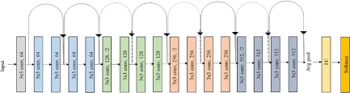
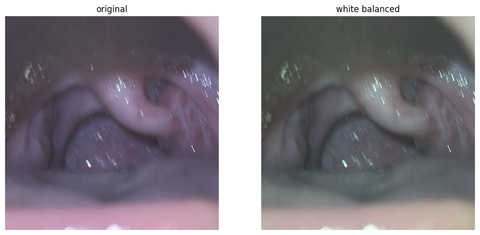
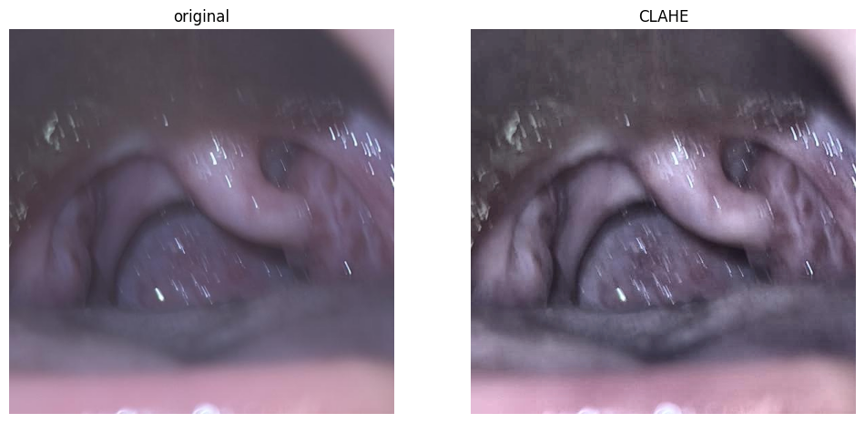

# StrepClassification
[](https://opensource.org/licenses/MIT)
---

### Project Overview and Description
Strep pharyngitis is an acute bacterial infection of the pharynx/tonsils caused by Streptococcus pyogenes (Group A Streptococcus, GAS). It is classified as an infectious pharyngitis, commonly presenting with abrupt fever, sore throat, and tonsillar exudates, often lacking cough or cold symptoms. The project focuses on classifying whether a patient has Strep pharyngitis using Deep Learning. The CNN model used is ResNet-18 followed by a Multi-Layer Perceptron.

### Classification process

#### Model
The Convolutional Neural Network Model used is ResNet-18. The approach uses transfer learning to learning the throat features using the model. The last fully connected layer is removed so that the model outputs 512 features. For model training, every layer except the layer4 is frozen. The model trains the weights only of the layer4.   



#### Dataset

#### Image Processing.
##### White Balancing
White balancing is an image processing technique that removes unnatural color casts by adjusting the RGB channels so that neutral objects appear neutral white or gray. As the image is taken in the mouth, the redness of the mouth could be enhanced due to different lighting condition. To make the input image robust, we balance the image colors, so that we have consistent input to the model.




##### CLAHE
CLAHE (Contrast Limited Adaptive Histogram Equalization) is an image processing technique used to enhance the contrast in throat images, making it a valuable preprocessing step for automated strep throat classification. When combined with smartphone imaging and machine learning, this method helps to better highlight features like tonsillar exudate, inflammation, and red spots.




### Folder Directory
```text
+---data
|   +---cnh_dataset
|   +---csv
|   \---kaggle_dataset
|       +---test
|       \---train
|           +---no
|           \---phar
+---models
+---research
\---src
    +---common
    |   \---__pycache__
    +---pipeline
    |   \---__pycache__
    +---utils
    |   \---__pycache__
    \---__pycache__)
```

### Development Team
Ameya Konkar | Master of Engineering, Robotics | University of Maryland, College Park

### External Dependencies
- [Anaconda](https://anaconda.org/)
- [Opencv](https://github.com/opencv/opencv)
- [sklearn](https://scikit-learn.org/)
- [PyTorch](https://pytorch.org/)
- [Pandas](https://pandas.pydata.org/)

### Installation instructions
Install Anaconda on your Operating System
Create an Anaconda pseudo environment
```
conda create --name <env_name> python=3.10
conda activate <env_name>
pip3 install requirements.txt
```
Clone the git repo
```
cd <workspace>
sudo apt-get install git
git clone --recursive https://github.com/ameyakonk/StrepClassification.git

```
Run main.py file in the root directory to train model and evaluate it. (Note: Make sure the python interpretor is from the conda environment).
There are two datasets:
1. cnh_dataset
2. kaggle_dataset
To choose between the two, pass the "cnh" for cnh_dataset or "kaggle" for kaggle_dataset. For e.g.
```
python3 main.py --dataset kaggle
```


